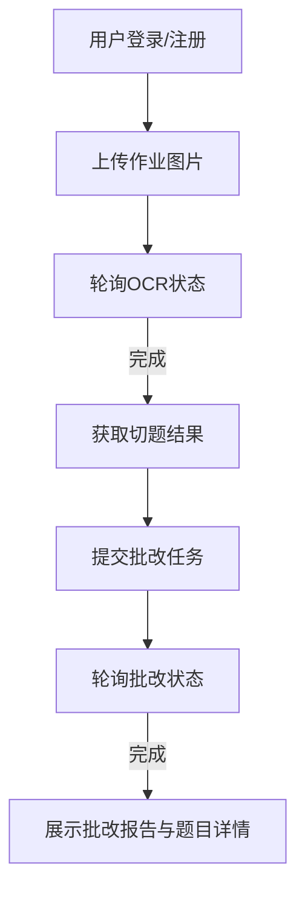

## 1. 产品概述
基于大模型的中小学作业批改系统前端，提供一体化的智能作业批改体验。
- 主要解决学生上传作业、自动切题识别、智能批改与生成综合报告的问题。
- 采用SPA（单页面应用）架构，所有交互无缝在当前页面完成。

## 2. 核心功能

### 2.1 用户角色
| 角色 | 注册方式 | 核心权限 |
|------|---------------------|------------------|
| 学生/用户 | 账号密码注册 | 上传作业，查看批改结果与报告，管理历史任务 |

### 2.2 功能模块
1. **登录/注册模块**: 账号认证。
2. **作业工作台**: 上传作业图片，轮询展示处理进度，展示识别结果并提交批改，最终展示批改报告与题目得分详情。

### 2.3 页面详情 (单页面多模块)
| 模块名称 | 功能描述 |
|-------------|---------------------|
| 认证模块 | 提供登录与注册表单，成功后保存JWT Token。 |
| 上传模块 | 支持拖拽与点击上传图片，触发自动清洗和OCR。 |
| 进度模块 | 轮询任务状态（OCR进度、批改进度），展示进度条或状态提示。 |
| 识别确认模块 | （可选）展示切题结果，并确认提交至大模型批改。 |
| 报告与详情模块 | 展示最终的总分、正确率、大模型评语，以及各题目的原图、识别文本、正确答案、得分和批注。 |

## 3. 核心流程
用户登录后，在工作台上传作业图片。系统自动开始OCR处理，前端轮询状态直至完成；完成后系统展示切题数据并自动或手动提交批改，前端再次轮询批改状态，完成后展示最终成绩和评价。

## 4. 用户界面设计
### 4.1 设计风格
- 主色调：现代教育蓝（如 #409EFF）与极简白。
- 按钮风格：Element Plus 默认圆角，带轻微阴影（提升层次感）。
- 字体：系统默认字体，标题使用稍大字号加粗。
- 布局：居中卡片式设计，操作区域集中，减少视觉负担。

### 4.2 页面设计概述
| 模块名称 | UI元素 |
|-------------|-------------|
| 工作台 | 顶部导航（欢迎信息与登出），中央为功能切换区（上传区/进度区/结果区），使用卡片(el-card)和步骤条(el-steps)引导用户。 |

### 4.3 响应式
- 优先支持桌面端，主要在PC端进行作业图片的拖拽与查看。
